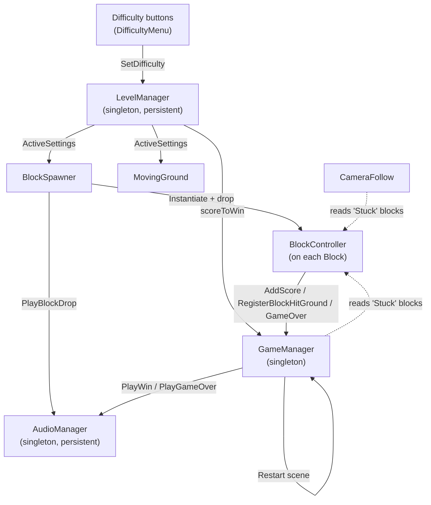
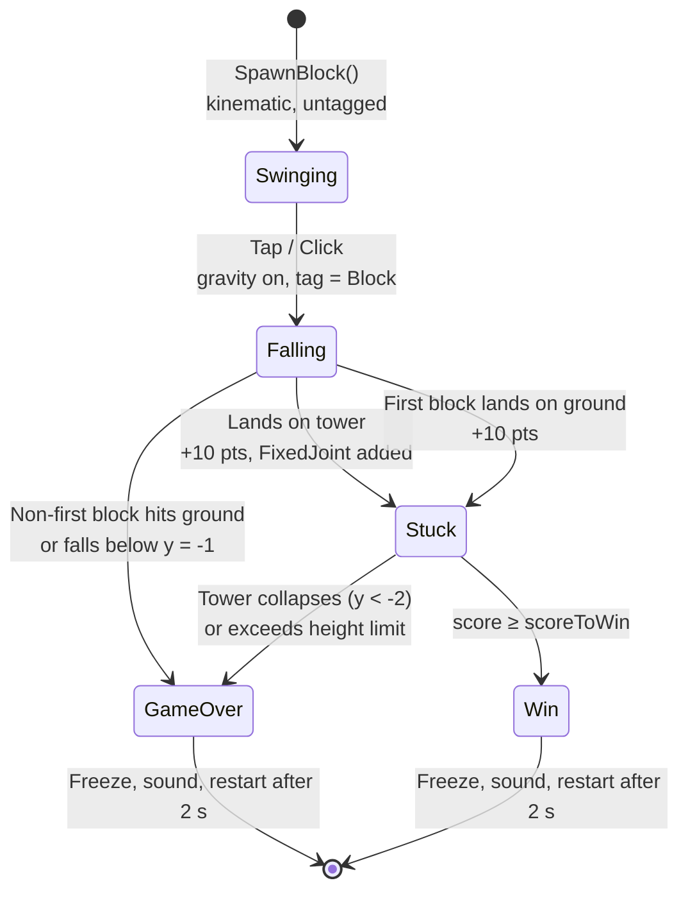

# Tower Builder

A physics-based tower-stacking game built with **Unity 2022.3 LTS** and **C#**. Blocks swing from a rope above the tower, and the player taps (or clicks) to release each block at the right moment. Place them carefully to build a stable tower. Choose a difficulty, reach the target score, and don't let a block hit the ground.


---

## Table of Contents

- [Overview](#overview)
- [Features](#features)
- [How to Play](#how-to-play)
- [Game Rules](#game-rules)
- [Difficulty Levels](#difficulty-levels)
- [Getting Started](#getting-started)
- [Building the Game](#building-the-game)
- [Project Structure](#project-structure)
- [Architecture](#architecture)
- [Script Reference](#script-reference)
- [Configuration and Tuning](#configuration-and-tuning)
- [Audio](#audio)

---

## Overview

Tower Builder is a short-session, skill-based arcade game. It was developed as the team project for **Game Development Fundamentals (CSCI-4836)**. The game uses Unity's built-in 3D physics: each released block is a rigid body that falls, collides and settles on the tower. Once a block lands on the tower, it is locked in place with a physics joint, so the tower reacts as one structure.

The core loop is simple:

1. A block swings back and forth on a rope above the tower.
2. The player releases it with a single tap or click.
3. A block that lands on the tower earns points. A block that misses ends the round.

---

## Features

| Feature | Description |
|---|---|
| **Swinging-block mechanic** | Each block hangs from a rope and moves along a pendulum-like arc. A `LineRenderer` draws the rope. |
| **One-touch controls** | Tap (mobile) or left-click (desktop) to drop the block. |
| **Real rigid-body physics** | Released blocks switch from kinematic to dynamic and are driven by gravity and collisions. |
| **Joint-based stacking** | A landed block is attached to the block below it with a `FixedJoint`, so the tower behaves as one connected structure. |
| **Three difficulty levels** | Easy, Medium and Hard change the swing speed, swing width and swing depth. Medium and Hard also add a moving ground platform. |
| **Moving ground platform** | On higher difficulties, the base slides from side to side, so every drop has a moving target. |
| **Dynamic camera** | The camera follows the top of the tower smoothly as it grows. |
| **Live scoring** | The on-screen score (TextMeshPro) updates with every successful placement. |
| **Win and loss handling** | The game detects wins and losses, freezes the tower, plays audio feedback and restarts automatically. |
| **Audio system** | Persistent background music plus sound effects for dropping a block, winning and losing. |
| **Stylized environment** | Custom sunset skybox, textured tower blocks and a textured ground. |

---

## How to Play

1. **Choose a difficulty.** Use the **Easy**, **Medium** or **Hard** buttons on screen. The game starts on **Easy** by default.
2. **Watch the swing.** A block hangs from the rope anchor and swings along an arc above the tower.
3. **Drop the block.** Tap the screen or click the left mouse button to release it.
4. **Stack accurately.** Land each block on top of the tower. The first block must land on the ground platform.
5. **Reach the target.** Keep stacking until you reach the target score for your difficulty.

> **Tip:** Release the block when it is near the centre of its swing, directly above the tower. On Medium and Hard, also watch the platform, because it moves too.

---

## Game Rules

### Scoring

| Event | Points |
|---|---|
| First block lands on the ground | +10 |
| A block lands on the tower | +10 |

### Win condition

- The round is won when the score reaches the difficulty's `scoreToWin` value. The default is **100 points**, which means **10 blocks** placed.

### Loss conditions

The round ends immediately if any of these happen:

- Any block **after the first** lands on the ground instead of on the tower.
- A falling block drops below the play area (`y < -1`).
- A block that is already part of the tower falls below the play area (`y < -2`), meaning the tower has collapsed.
- The tower grows beyond the maximum height limit (`y > 20`).

### After a round

After a win or a loss, all tower joints are removed and the blocks are frozen in place. The matching sound plays, and the scene **restarts automatically after 2 seconds**. The selected difficulty is kept between rounds.

---

## Difficulty Levels

Difficulty presets are set on the `LevelManager` object in `SampleScene`:

| Setting | Easy | Medium | Hard |
|---|:---:|:---:|:---:|
| Swing amplitude (horizontal range) | 2.0 | 2.0 | 3.0 |
| Swing speed | 1.5 | 2.0 | 2.5 |
| Swing height (vertical arc depth) | 0.4 | 0.5 | 0.6 |
| Score to win | 100 | 100 | 100 |
| Moving ground | No | Yes | Yes |
| Ground move range | — | 1.0 | 1.0 |
| Ground move speed | — | 1.0 | 1.0 |

The block follows this path:

```
x = sin(t × swingSpeed) × swingAmplitude
y = spawnHeight − cos(t × swingSpeed) × swingHeight
```

The moving ground follows this path:

```
x = startX + sin(t × groundMoveSpeed) × groundMoveRange
```

---

## Getting Started

### Prerequisites

| Requirement | Version / Notes |
|---|---|
| Unity Hub | Latest |
| Unity Editor | **2022.3.56f1 LTS**. Other 2022.3 LTS versions should also work. |
| Git | With **[Git LFS](https://git-lfs.com/)** installed (`.png`, `.psd` and `.wav` files are stored in LFS) |
| Android Build Support | Optional. Required only for Android builds. |
| iOS Build Support + Xcode | Optional. Required only for iOS builds (macOS only). |
| IDE | Visual Studio, JetBrains Rider or VS Code with the Unity extension |

### Installation

1. **Clone the repository** and download the LFS assets:

   ```bash
   git lfs install
   git clone https://github.com/nqasanova/Tower-Builder-Game.git
   cd Tower-Builder-Game
   git lfs pull
   ```

2. **Open the project in Unity Hub:**
   - Click **Add → Add project from disk**.
   - Select the **`Tower Game`** folder. This folder is the Unity project root, not the repository root.
   - If prompted, open the project with Unity **2022.3.56f1**.

3. **Open the main scene:** `Assets/Scenes/SampleScene.unity`.

4. **Press Play** in the editor.

> **Mobile preview:** Open **Window → General → Device Simulator** to test the game in phone screen sizes. The Device Simulator devices package is already included.

---

## Building the Game

1. Open **File → Build Settings**.
2. Click **Add Open Scenes** so that `SampleScene` is included in the build. (The build scene list is currently empty.)
3. Select the target platform and click **Switch Platform**.

### Android

1. Install **Android Build Support** (SDK, NDK and OpenJDK) through Unity Hub.
2. In **Player Settings → Other Settings**, set a unique **Package Name**, for example `com.gamechangers.towerbuilder`.
3. Minimum API level: **Android 5.1 (API 22)**. This is already configured.
4. Click **Build** to create an `.apk`, or **Build and Run** to install it on a connected device.

### iOS

1. Install **iOS Build Support** through Unity Hub.
2. Set a **Bundle Identifier** in **Player Settings**.
3. Click **Build** to create an Xcode project. Then open it in Xcode, set up signing and deploy it to a device.

### Desktop (Windows / macOS / Linux)

Select **Windows, Mac, Linux** as the target and click **Build**. The mouse controls work without any changes.

---

## Project Structure

```
Tower-Builder-Game/
├── README.md
├── .gitattributes                 # Git LFS rules (png, psd, wav)
└── Tower Game/                    # Unity project root
    ├── Assets/
    │   ├── Audio/
    │   │   ├── background_music.mp3
    │   │   ├── block_drop.wav
    │   │   ├── game_over.mp3
    │   │   └── goodresult-82807.mp3      # Win sound
    │   ├── Prefab/
    │   │   └── Block.prefab              # Rigidbody + BoxCollider + BlockController
    │   ├── Scenes/
    │   │   └── SampleScene.unity         # Main (and only) game scene
    │   ├── Scripts/
    │   │   ├── AudioManager.cs
    │   │   ├── BlockController.cs
    │   │   ├── BlockSpawner.cs
    │   │   ├── CameraFollow.cs
    │   │   ├── DifficultyMenu.cs
    │   │   ├── GameDifficulty.cs
    │   │   ├── GameManager.cs
    │   │   ├── LevelManager.cs
    │   │   ├── LevelSettings.cs
    │   │   └── MovingGround.cs
    │   ├── TextMesh Pro/                 # TMP essential resources
    │   ├── RopeMaterial.mat              # Rope (LineRenderer) material
    │   ├── SkySunset.mat                 # Active skybox
    │   ├── SkyNight.mat                  # Alternate skybox (not in use)
    │   ├── Tower Block.mat / Tower03Windows.mat
    │   └── *.png / *.jpeg                # Block and ground textures
    ├── Packages/
    │   └── manifest.json
    └── ProjectSettings/
```

### Scene hierarchy (`SampleScene`)

| GameObject | Components / Role |
|---|---|
| `Main Camera` | `CameraFollow`: follows the top of the tower |
| `Directional Light` | Scene lighting |
| `Ground` | Tagged `Ground`; `MovingGround`: slides on Medium and Hard |
| `RopeAnchor` | The fixed point the rope hangs from |
| `BlockSpawner` | `BlockSpawner` + `LineRenderer`: spawns, swings and drops blocks |
| `GameManager` | `GameManager`: score, win and loss, restart |
| `LevelManager` | `LevelManager`: difficulty presets (persists between scene loads) |
| `AudioManager` | `AudioManager` + 2 × `AudioSource` (music and sound effects; persists between scene loads) |
| `DifficultyMenu` | `DifficultyMenu`: button handlers |
| `Canvas` | `ScoreText` (TMP) and the **Easy / Medium / Hard** buttons |
| `EventSystem` | UI input |

### Tags

| Tag | Meaning |
|---|---|
| `Ground` | The base platform |
| `Block` | A block that has been released and is falling |
| `Stuck` | A block that has landed and is now part of the tower |

---

## Architecture

The game uses a small set of **singleton managers** together with **component-based** gameplay scripts.



### Block lifecycle



---

## Script Reference

### `BlockSpawner.cs`
Spawns each block **3 units below the rope anchor**, keeps it kinematic while it swings, and releases it on input.

| Member | Description |
|---|---|
| `blockPrefab` | The block to create (`Prefab/Block.prefab`) |
| `ropeAnchorPoint` | The transform the rope hangs from |
| `ropeMaterial` | Material used by the `LineRenderer` rope (0.1 units wide) |
| `SpawnBlock()` | Creates a kinematic block and shows the rope |
| `MoveBlock()` | Applies the swing formula using the active `LevelSettings` |
| `DropBlock()` | Turns on physics, tags the block as `Block`, raises the next swing height by 1.2 units, marks the first block, plays the drop sound and spawns the next block after **0.5 s** |
| `UpdateRope()` | Redraws the rope from the anchor to the top of the block every frame |

### `BlockController.cs`
Attached to every block. It handles what happens when the block lands.

| Member | Description |
|---|---|
| `SetAsFirstBlock()` | Allows this block to land on the ground without ending the game |
| `OnCollisionEnter()` | On the first valid contact: scores the landing, connects the block to the one below with a `FixedJoint` and changes the tag to `Stuck`. A non-first block that hits the ground triggers a game over. |
| `Update()` | Triggers a game over if the block falls below `y = -1` before landing |

### `GameManager.cs` (singleton)
Controls score, the win and loss states, and restarting the round.

| Member | Description |
|---|---|
| `AddScore(int)` | Adds points, updates `ScoreText` and checks the win condition |
| `GameOver()` | Runs once per round: plays the game-over sound, freezes the tower and restarts after 2 s |
| `GameWin()` | Runs once per round: plays the win sound, freezes the tower and restarts after 2 s |
| `RegisterBlockHitGround()` | Called when a non-first block lands on the ground; ends the game |
| `BreakAllBlockJoints()` | Removes all `FixedJoint`s and freezes every tower block |
| `Update()` | Checks every frame for tower collapse and for the height limit |

### `LevelManager.cs` (singleton, `DontDestroyOnLoad`)
Holds the three `LevelSettings` presets and exposes the selected one through `ActiveSettings`. The selected difficulty is kept when the scene restarts.

### `LevelSettings.cs`
A serializable data class containing: `swingAmplitude`, `swingSpeed`, `swingHeight`, `scoreToWin`, `hasMovingGround`, `groundMoveRange` and `groundMoveSpeed`.

### `GameDifficulty.cs`
Enum: `Easy`, `Medium`, `Hard`.

### `DifficultyMenu.cs`
Button handlers (`SetEasy`, `SetMedium`, `SetHard`) that set the difficulty and reload `SampleScene`.

### `MovingGround.cs`
Moves the ground from side to side along a sine wave when `hasMovingGround` is enabled for the active difficulty.

### `CameraFollow.cs`
Keeps the camera `yOffset` (default **5**) units above the highest tower block. It moves smoothly using `followSpeed` (default **2**). The camera only moves up, never down.

### `AudioManager.cs` (singleton, `DontDestroyOnLoad`)
Uses two `AudioSource`s: one for looping background music and one for sound effects.

| Method | Plays |
|---|---|
| `PlayBlockDrop()` | Block release sound |
| `PlayWin()` | Stops the music, then plays the win sound |
| `PlayGameOver()` | Stops the music, then plays the game-over sound |
| `PlayBackgroundMusic()` | Resumes looping music (called when the round restarts) |

---

## Configuration and Tuning

Most of the gameplay can be changed in the **Unity Inspector** without editing code:

| What to change | Where |
|---|---|
| Difficulty presets (swing, target score, moving ground) | `LevelManager` → *Easy / Medium / Hard Settings* |
| Default difficulty at startup | `LevelManager` → *Current Difficulty* |
| Camera follow speed and offset | `Main Camera` → `CameraFollow` |
| Rope appearance | `BlockSpawner` → *Rope Material*; `Assets/RopeMaterial.mat` |
| Block size, mass and material | `Assets/Prefab/Block.prefab` (default scale 1.5, mass 1) |
| Music and sound effects | `AudioManager` → audio clip fields |
| Skybox | **Window → Rendering → Lighting → Environment** (`SkySunset` or `SkyNight`) |
| Gravity | **Project Settings → Physics** (default −9.81) |

Some values are currently set directly in the code. Change them in the scripts if needed:

| Value | Location |
|---|---|
| Points per block (`10`) | `BlockController.cs` |
| Maximum tower height (`20`) | `GameManager.Update()` |
| Collapse threshold (`-2`) and miss threshold (`-1`) | `GameManager.cs`, `BlockController.cs` |
| Restart delay (`2 s`), next-block delay (`0.5 s`) | `GameManager.cs`, `BlockSpawner.cs` |
| Next swing height increase (`1.2`) | `BlockSpawner.DropBlock()` |

---

## Audio

| File | Used for |
|---|---|
| `background_music.mp3` | Looping in-game music |
| `block_drop.wav` | A block is released |
| `game_over.mp3` | The round is lost |
| `goodresult-82807.mp3` | The round is won |

<sub>This project was created for educational purposes.</sub>
